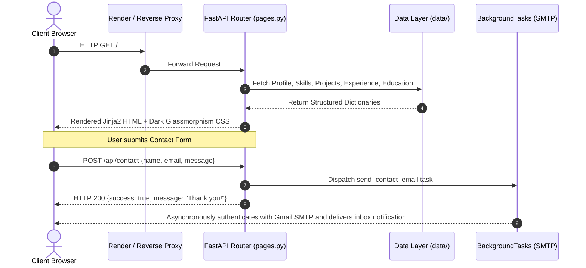
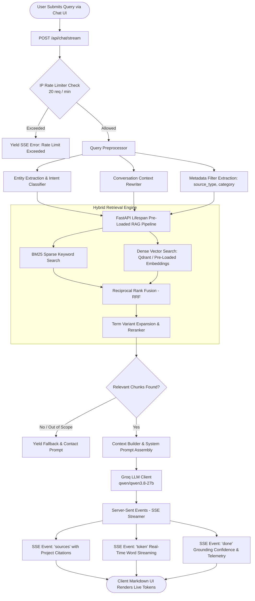
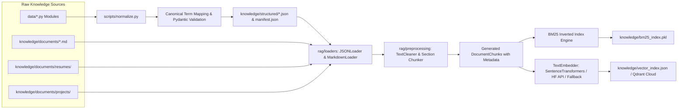

# 🚀 Akhil Vikram Singh - AI/ML & Data Science Portfolio with Real-Time RAG Chatbot

[](https://portfolio-2l4f.onrender.com/)
[](https://fastapi.tiangolo.com)
[](https://www.python.org/)
[](https://qdrant.tech/)
[](https://groq.com/)
[](https://www.docker.com/)
[](https://opensource.org/licenses/MIT)

> A modern, production-grade personal portfolio and intelligent AI assistant engineered with **Python (FastAPI)**, **Jinja2**, a custom **Dark Glassmorphism UI System**, and an end-to-end **Hybrid RAG (Retrieval-Augmented Generation) & SSE Streaming Chatbot** powered by **BM25**, **Vector Search (Qdrant / Dense Embeddings)**, **Reranking**, and **Groq LPUs**.

🔗 **Live Production URL:** [https://portfolio-2l4f.onrender.com/](https://portfolio-2l4f.onrender.com/)  
📚 **Interactive Swagger API Docs:** [https://portfolio-2l4f.onrender.com/docs](https://portfolio-2l4f.onrender.com/docs)  
🩺 **Production Health Endpoint:** [https://portfolio-2l4f.onrender.com/health](https://portfolio-2l4f.onrender.com/health)

---

## 📑 Table of Contents

- [🌟 Architectural Highlights](#-architectural-highlights)
- [🔄 Complete System Workflows](#-complete-system-workflows)
  - [1. User Interaction & Page Serving Workflow](#1-user-interaction--page-serving-workflow)
  - [2. Hybrid RAG & Real-Time Chatbot Workflow](#2-hybrid-rag--real-time-chatbot-workflow)
  - [3. Data Ingestion & Indexing Pipeline](#3-data-ingestion--indexing-pipeline)
- [📁 Project Architecture & File Directory](#-project-architecture--file-directory)
- [⚡ Key Features](#-key-features)
  - [🎨 Modern Dark Glassmorphism Frontend](#-modern-dark-glassmorphism-frontend)
  - [🤖 Intelligent RAG Chatbot Service](#-intelligent-rag-chatbot-service)
  - [⚡ Sub-30ms Hybrid Retrieval Engine](#-sub-30ms-hybrid-retrieval-engine)
  - [📨 Asynchronous Background Email Engine](#-asynchronous-background-email-engine)
  - [📊 Benchmarking & Evaluation Suite](#-benchmarking--evaluation-suite)
- [📡 REST API Reference](#-rest-api-reference)
- [🚀 Quick Start & Local Setup](#-quick-start--local-setup)
  - [Prerequisites](#prerequisites)
  - [Step 1: Clone Repository & Setup Virtual Environment](#step-1-clone-repository--setup-virtual-environment)
  - [Step 2: Install Dependencies](#step-2-install-dependencies)
  - [Step 3: Configure Environment Variables (`.env`)](#step-3-configure-environment-variables-env)
  - [Step 4: Launch the Application](#step-4-launch-the-application)
- [🧪 Testing, Validation & Benchmarking](#-testing-validation--benchmarking)
  - [Running Unit & Integration Tests](#running-unit--integration-tests)
  - [Validating Knowledge Schemas](#validating-knowledge-schemas)
  - [Running RAG & LLM Evaluation Benchmarks](#running-rag--llm-evaluation-benchmarks)
- [🐳 Docker & Production Deployment](#-docker--production-deployment)
  - [Running with Docker Locally](#running-with-docker-locally)
  - [Deploying to Render](#deploying-to-render)
- [⚙️ Content Customization Guide](#️-content-customization-guide)
- [👤 Author & Connect](#-author--connect)
- [📜 License](#-license)

---

## 🌟 Architectural Highlights

| Layer | Technologies & Implementations |
| :--- | :--- |
| **Frontend & UI** | Jinja2 Server-Side Templates, Custom Vanilla CSS Design System (Dark Glassmorphism, Neon Glows, CSS Custom Properties), Vanilla JS, FontAwesome, Highlight.js |
| **Backend Framework** | FastAPI (ASGI), Uvicorn, Starlette, Pydantic v2 |
| **Retrieval (RAG)** | Hybrid Reciprocal Rank Fusion (RRF), BM25 Sparse Keyword Search, Dense Semantic Vector Search (`all-MiniLM-L6-v2` / Qdrant Cloud), Cross-Encoder & Term-Variant Reranking |
| **AI / LLM Engine** | Groq LPU Cloud (`qwen/qwen3.8-27b` / `llama-3.3-70b-versatile`), Server-Sent Events (SSE) Token Streaming, Strict Grounding & Anti-Hallucination Guardrails |
| **Safety & Resilience** | In-memory Sliding Window IP Rate Limiting (20 req/min), Reverse-Proxy Header Inspection (`X-Forwarded-For`), Input Length Clamping, Graceful Zero-Result Fallbacks |
| **Evaluation & Metrics** | Custom Benchmarking Suite for MRR, Hit Rate@K, Cosine Similarity Separation, Token Latency & Throughput |
| **DevOps & Infrastructure** | Multi-Stage `Dockerfile` (Python 3.11-slim, optimized layer caching), `render.yaml` Infrastructure-as-Code Blueprint with `/health` monitor |

---

## 🔄 Complete System Workflows

### 1. User Interaction & Page Serving Workflow



### 2. Hybrid RAG & Real-Time Chatbot Workflow



### 3. Data Ingestion & Indexing Pipeline



---

## 📁 Project Architecture & File Directory

```text
portfolio/
├── app/                              # Core FastAPI Application Package
│   ├── __init__.py                   # App factory, lifespan context manager (RAG preloading), static mounts
│   ├── main.py                       # Application execution entry point (Uvicorn runner)
│   ├── routes/
│   │   ├── __init__.py               # Routes package initializer
│   │   ├── pages.py                  # Page routes (/, /projects, /projects/{id}, /resume, /health, /api/contact, /api/rag/search)
│   │   └── chat.py                   # Chatbot routes (POST /api/chat/stream [SSE], POST /api/chat [JSON])
│   ├── static/
│   │   ├── css/
│   │   │   └── style.css             # Unified Dark Glassmorphism design system & responsive layout styles
│   │   ├── images/projects/          # Project graphic preview banners
│   │   └── resume/
│   │       ├── resume-aiml.pdf       # Specialized AI / ML Resume
│   │       └── resume-data-analyst.pdf # Specialized Data Analyst Resume
│   └── templates/
│       ├── base.html                 # Master Jinja2 layout: header, navigation, chat widget drawer, footer
│       ├── index.html                # Main landing page: Hero, Stats, Skills, Experience, Projects, Education, Contact
│       ├── projects.html             # Dedicated project catalog gallery with category filtering
│       └── project.html              # Comprehensive deep-dive project case study view
│
├── chatbot/                          # AI Assistant & RAG Query Pipeline
│   ├── context/
│   │   └── builder.py                # Assembles retrieved chunks into markdown context for LLM prompt
│   ├── llm/
│   │   └── client.py                 # Async Groq API client with token streaming and retry logic
│   ├── models/
│   │   ├── request.py                # ChatRequest & ChatMessage Pydantic input schemas
│   │   └── response.py               # ChatResponse, SourceItem, Citation Pydantic output schemas
│   ├── prompts/
│   │   └── system.py                 # Grounded system prompts, anti-hallucination rules, tone instructions
│   ├── query/
│   │   └── processor.py              # Query cleaner, intent analyzer, filter inference, history rewriter
│   ├── safety/
│   │   ├── rate_limiter.py           # In-memory sliding window IP rate limiter (20 req / min)
│   │   └── validator.py              # Output groundness, confidence score, and validation checks
│   ├── streaming/
│   │   └── sse.py                    # Server-Sent Events (SSE) protocol formatter (sources, token, done, error)
│   └── service.py                    # Master ChatbotService orchestrator combining all pipeline steps
│
├── rag/                              # Modular Retrieval-Augmented Generation Engine
│   ├── embeddings/
│   │   └── embedder.py               # Vector embedder (SentenceTransformers, HF API, lightweight deterministic fallback)
│   ├── loaders/
│   │   ├── json_loader.py            # Converts structured JSON entities into section-formatted markdown documents
│   │   └── markdown_loader.py        # Parses markdown documentation files and extracts frontmatter metadata
│   ├── models/
│   │   └── document.py               # Document, DocumentChunk, SearchResult data classes
│   ├── preprocessing/
│   │   ├── chunker.py                # Sliding-window section-aware chunker with metadata propagation
│   │   └── cleaner.py                # Whitespace, markdown, and unicode normalization cleaner
│   ├── retrieval/
│   │   ├── bm25.py                   # Sparse keyword BM25 Okapi retriever
│   │   ├── hybrid.py                 # Reciprocal Rank Fusion (RRF) combiner for BM25 + Vector results
│   │   ├── qdrant.py                 # Qdrant Cloud vector database connector
│   │   ├── reranker.py               # Term-variant expansion and cross-similarity reranker
│   │   └── vector.py                 # In-memory cosine similarity vector retriever
│   └── pipeline.py                   # Master RAGPipeline orchestrating ingest, indexing, search & reranking
│
├── data/                             # Decoupled Python Data Sources (Pure Python)
│   ├── __init__.py                   # Package exports and getter helpers
│   ├── profile.py                    # Bio, roles, taglines, social links, stats, and highlights
│   ├── projects.py                   # Full case-study data: problem, solution, metrics, challenges, architecture
│   ├── skills.py                     # 40+ categorized skills with brand icons, proficiency percentages, and neon colors
│   ├── experience.py                 # Career timeline: roles, companies, achievements, technologies, durations
│   └── education.py                  # University degree and certifications with verified credential links
│
├── knowledge/                        # RAG Knowledge Base & Pre-Computed Indices
│   ├── bm25_index.pkl                # Pre-built serialized BM25 sparse index (sub-millisecond load)
│   ├── vector_index.json             # Pre-built dense vector embeddings index for immediate availability
│   ├── manifest.json                 # Knowledge manifest with entity counts and data versions
│   ├── schemas.py                    # Strict Pydantic schemas validating all knowledge entities
│   ├── structured/                   # Normalized structured JSON data (projects, skills, profile, experience, etc.)
│   └── documents/                    # Granular Markdown documents, resumes, and project case studies
│
├── metrics/                          # Benchmark & Telemetry Evaluation Suite
│   ├── chunking_retrieval.py         # Precision, Recall, Hit Rate@K, and MRR evaluation
│   ├── embedding_eval.py             # Embedding throughput and semantic cosine separation evaluation
│   ├── eval_runner.py                # Master CLI test runner executing full RAG benchmark suite
│   ├── llm_performance.py            # Latency, First-Token Time, and Tokens/sec benchmarks
│   └── similarity_search.py          # Vector query latency and top-K ranking evaluation
│
├── scripts/                          # Automation & Maintenance Utilities
│   ├── generate_indices.py           # Ingests knowledge base and saves BM25 + Vector indices to disk
│   ├── normalize.py                  # Normalizes skills via canonical map and exports validated JSON files
│   └── validate.py                   # Pydantic schema validation suite for portfolio structure integrity
│
├── tests/                            # Comprehensive Automated Test Suite
│   ├── test_api.py                   # Integration tests for FastAPI endpoints (/health, /api/rag/search)
│   ├── test_chatbot.py               # 34+ Unit tests covering chatbot, rate limiter, streaming, prompts
│   ├── test_chunking.py              # Chunk size, overlap, and boundary tests
│   ├── test_environment.py           # Configuration and environment variable assertions
│   ├── test_metadata.py              # Schema correctness tests for document metadata
│   ├── test_pipeline.py              # Ingestion, hybrid retrieval, and fallback tests
│   └── test_retrieval.py             # Accuracy and relevance tests across real user questions
│
├── Dockerfile                        # Multi-stage production container build (Python 3.11-slim)
├── render.yaml                       # Infrastructure-as-Code Blueprint for Render Cloud deployment
├── requirements.txt                  # Production Python dependencies
├── .env.example                      # Template for secrets and credentials
└── README.md                         # Project documentation
```

---

## ⚡ Key Features

### 🎨 Modern Dark Glassmorphism Frontend
- **Aesthetic Excellence**: Deep dark theme (`#080d1a` / `#0f172a`), frosted glass cards (`backdrop-filter: blur(16px)`), dynamic gradient accents, and neon glows.
- **Hero Terminal & Live Stats**: Interactive CLI-style hero card showcasing active tech stack, quick commands, and dynamic stats counters (years of experience, deployed models, records analyzed).
- **Categorized 40+ Skills Matrix**: Organized into Machine Learning, Generative AI & RAG, Data Analytics & Visualization, and Cloud/DevOps with custom glowing brand badges.
- **Interactive Vertical Timeline**: Career history grouped chronologically with expandable milestone metrics and tech stack chips.
- **Deep-Dive Project Detail Pages (`/projects/{slug}`)**:
  - 🔴 **Problem Statement**
  - 💡 **Proposed Solution & Architecture**
  - ⚙️ **Personal Role & Engineering Contribution**
  - 🛡️ **Technical Challenges & Root-Cause Fixes**
  - 📊 **Key Results & Business Metrics Grid**
- **Dual Inline PDF Resumes**: Instant in-browser PDF viewing for both **AI/ML Specialist** (`/resume?type=aiml`) and **Data Analyst** (`/resume?type=data-analyst`).

### 🤖 Intelligent RAG Chatbot Service
- **Real-Time Token Streaming**: Server-Sent Events (`POST /api/chat/stream`) deliver immediate, word-by-word streaming responses with sub-second time-to-first-token.
- **Strict Anti-Hallucination Grounding**: Responses are strictly synthesized using retrieved documents from Akhil's verified knowledge base.
- **Direct Source Citations**: Every answer includes clickable source pills linking directly to referenced projects, resumes, and experience entries.
- **Out-of-Scope Fallback**: If a question is outside the portfolio scope, the assistant politely informs the user and invites them to use the contact form.

### ⚡ Sub-30ms Hybrid Retrieval Engine
- **Pre-Loaded Lifespan Architecture**: Indices are loaded **once** into memory at server startup via FastAPI's async lifespan context manager.
- **Hybrid Reciprocal Rank Fusion (RRF)**: Merges exact-match keyword strengths of **BM25** with the deep semantic understanding of dense vector embeddings.
- **Term-Variant Reranking**: Re-scores top-k candidates prioritizing title matches, domain synonyms, and section relevance.

### 📨 Asynchronous Background Email Engine
- **Non-Blocking Inquiries**: Contact form submissions (`POST /api/contact`) dispatch an asynchronous `BackgroundTask` using Python's native `smtplib` to deliver notifications directly to your Gmail inbox without delaying the browser UI.

### 📊 Benchmarking & Evaluation Suite
- **Comprehensive Quality Telemetry**: Includes specialized benchmark runners to evaluate retrieval accuracy (MRR, Hit Rate@K), semantic cosine separation, and LLM throughput (tokens/second, TTFT).

---

## 📡 REST API Reference

| Endpoint | Method | Description | Parameters / Payload |
| :--- | :---: | :--- | :--- |
| `/` | `GET` | Main portfolio landing page | None |
| `/projects` | `GET` | Dedicated projects gallery page | `category` *(optional query string)* |
| `/projects/{project_id}` | `GET` | Detailed project case study page | `project_id` *(path parameter: ID or slug)* |
| `/resume` | `GET` | Serves specialized PDF resume inline | `type`: `"aiml"` or `"data-analyst"` *(query)* |
| `/health` | `GET` | Health check and telemetry status | None |
| `/api/contact` | `POST` | Dispatches contact message via email | `{"name": str, "email": str, "subject": str, "message": str}` |
| `/api/rag/search` | `POST` | Queries knowledge base directly | `{"query": str, "top_k": int, "mode": "hybrid", "category": str}` |
| `/api/chat/stream` | `POST` | Real-time SSE token stream from chatbot | `{"query": str, "history": list, "conversation_id": str}` |
| `/api/chat` | `POST` | Standard JSON response from chatbot | `{"query": str, "history": list, "conversation_id": str}` |
| `/docs` | `GET` | Interactive Swagger UI API documentation | None |
| `/redoc` | `GET` | ReDoc API documentation | None |

---

## 🚀 Quick Start & Local Setup

### Prerequisites
- **Python 3.11+** installed ([Download Python](https://www.python.org/downloads/))
- **Git** installed ([Download Git](https://git-scm.com/))
- *(Optional)* Free [Groq API Key](https://console.groq.com/) for live LLM streaming responses
- *(Optional)* Gmail App Password for SMTP contact notifications

---

### Step 1: Clone Repository & Setup Virtual Environment

```bash
# Clone the repository
git clone https://github.com/sAkhil2027/portfolio.git
cd portfolio

# Create virtual environment
python -m venv .venv

# Activate virtual environment
# On Windows (PowerShell):
.venv\Scripts\Activate.ps1

# On macOS / Linux:
source .venv/bin/activate
```

---

### Step 2: Install Dependencies

```bash
pip install --upgrade pip
pip install -r requirements.txt
```

---

### Step 3: Configure Environment Variables (`.env`)

Create a `.env` file in the root directory:

```env
# Application Settings
PORT=10000
ENVIRONMENT=development
RELOAD=true

# Groq LLM Configuration (For AI Chatbot)
GROQ_API_KEY=gsk_your_groq_api_key_here
LLM_MODEL=qwen/qwen3.8-27b

# RAG & Embedding Optimization (1 = Zero RAM fallback, optimal for Render free tier)
USE_LIGHTWEIGHT_EMBEDDINGS=1
FAST_EVAL_MODE=0

# Gmail SMTP Contact Form Credentials (Optional)
SMTP_HOST=smtp.gmail.com
SMTP_PORT=587
SMTP_USER=your_email@gmail.com
SMTP_PASSWORD=your_16_character_app_password
NOTIFICATION_EMAIL=your_email@gmail.com

# Qdrant Vector Cloud (Optional - Falls back to preloaded vector index if unset)
QDRANT_URL=
QDRANT_API_KEY=
QDRANT_COLLECTION=portfolio_knowledge
```

> **Note on Gmail SMTP**: Use a 16-character [Google App Password](https://myaccount.google.com/apppasswords), not your personal Gmail login password.

---

### Step 4: Launch the Application

```bash
python -m app.main
```

Open your browser and visit:
- **Web Portfolio:** [http://127.0.0.1:10000](http://127.0.0.1:10000)
- **Interactive Swagger Docs:** [http://127.0.0.1:10000/docs](http://127.0.0.1:10000/docs)
- **System Health Status:** [http://127.0.0.1:10000/health](http://127.0.0.1:10000/health)

---

## 🧪 Testing, Validation & Benchmarking

### Running Unit & Integration Tests
Execute the comprehensive test suite (all 34 tests covering API endpoints, chatbot streaming, rate limiters, and RAG retrieval):

```bash
python -m unittest discover tests
```

### Validating Knowledge Schemas
Verify that all data modules, JSON datasets, and Markdown documents conform to strict Pydantic schemas:

```bash
python scripts/validate.py
```

### Running RAG & LLM Evaluation Benchmarks
Benchmark retrieval accuracy (Hit Rate, MRR), embedding separation, and LLM streaming latency:

```bash
python -m metrics.eval_runner
```

---

## 🐳 Docker & Production Deployment

### Running with Docker Locally

```bash
# Build Docker image
docker build -t akhil-portfolio .

# Run container on port 10000
docker run -p 10000:10000 --env-file .env akhil-portfolio
```

Access at `http://localhost:10000`.

---

### Deploying to Render

This repository includes a ready-to-deploy [`render.yaml`](render.yaml) Blueprint:

1. Push your code to your GitHub repository.
2. Sign in to [Render](https://render.com/).
3. Click **New +** → **Blueprint**.
4. Connect your GitHub repository: `sAkhil2027/portfolio`.
5. Render will automatically read `render.yaml`, configure Docker, set up health checks at `/health`, and start the service.
6. Add your secret environment variables in the Render Dashboard:
   - `GROQ_API_KEY`
   - `SMTP_USER`
   - `SMTP_PASSWORD`
   - `NOTIFICATION_EMAIL`

---

## ⚙️ Content Customization Guide

All personal content is decoupled from templates in clean Python modules under `data/`:

| To Update... | Edit File | Then Run |
| :--- | :--- | :--- |
| **Personal Bio, Title, Social Links** | `data/profile.py` | `python scripts/normalize.py` |
| **Projects & Case Studies** | `data/projects.py` | `python scripts/normalize.py` |
| **Skills & Proficiency Levels** | `data/skills.py` | `python scripts/normalize.py` |
| **Work Experience & Hackathons** | `data/experience.py` | `python scripts/normalize.py` |
| **Degrees & Certifications** | `data/education.py` | `python scripts/normalize.py` |
| **PDF Resumes** | `app/static/resume/` | Refresh browser |

---

## 👤 Author & Connect

**Akhil Vikram Singh**  
*AI/ML Engineer, Data Scientist & Data Analyst*

- 🌐 **Live Portfolio:** [portfolio-2l4f.onrender.com](https://portfolio-2l4f.onrender.com/)
- 💼 **LinkedIn:** [linkedin.com/in/akhilvikramsingh](https://www.linkedin.com/in/akhilvikramsingh/)
- 💻 **GitHub:** [github.com/sAkhil2027](https://github.com/sAkhil2027)
- 📧 **Email:** [sakhilvikram@gmail.com](mailto:sakhilvikram@gmail.com)

---

## 📜 License

Distributed under the **MIT License**. Feel free to use this architecture as inspiration or a template for your own developer portfolio.
